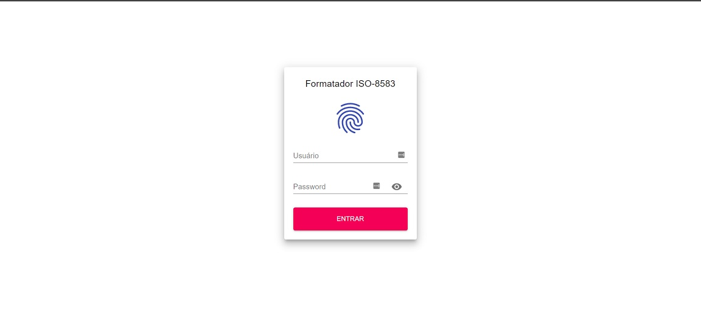
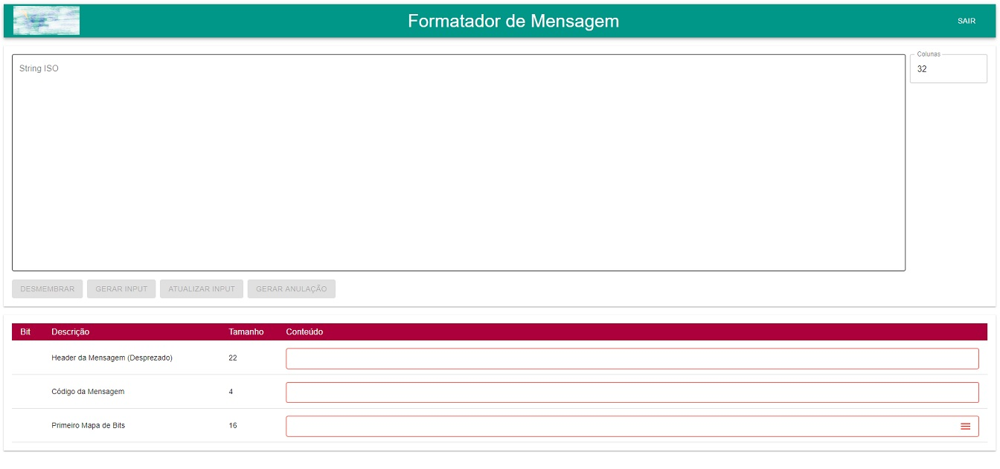
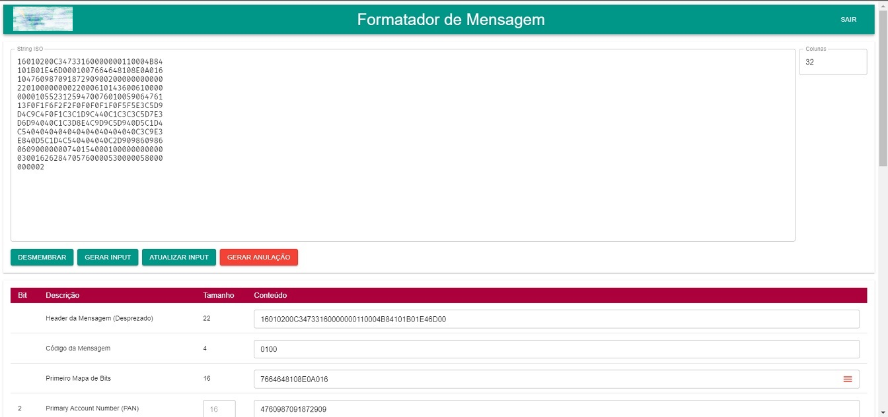
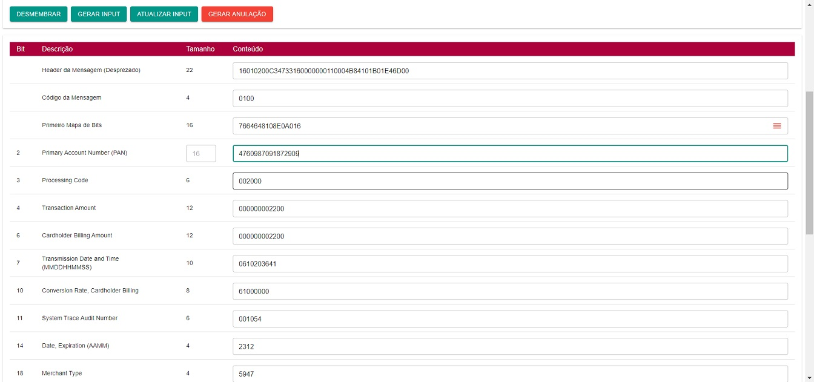

<div align="center">
  
  <h1>ISO-8583 Formatter</h1>
</div>

This is a financial message formatter in the [ISO 8583](https://pt.wikipedia.org/wiki/ISO_8583) standard, used by companies like VISA, MASTER and ELO.

# 📸 Screenshots






# Project structure

## 🛠️ Technologies

These are the technologies used throughout the project:

- [Node.js][nodejs]
- [ReactJS](reactjs)

# How to install and run

## 📌 Prerequisites

You need install:

- [Node.js][nodejs] (prefer version 12.17.0 or higher)
- [Yarn][yarn] (prefer version 1.21.1 or higher)

Clone this repository:

```bash
# Clone this repository
$ git clone https://github.com/deividr/formatador-iso.git

# Go into the repository
$ cd formatador-iso

# Install package's
$ yarn install

# Run script start
$ yarn start
```

# 📝 License

This project is under the MIT license. See the [LICENSE](LICENSE) for more information.

[nodejs]: https://nodejs.org/
[reactjs]: https://reactjs.org/
[yarn]: https://yarnpkg.com/

---

For more about [me:crown:](https://www.linkedin.com/in/deivid-assump%C3%A7%C3%A3o-rodrigues-a36a5685/).
